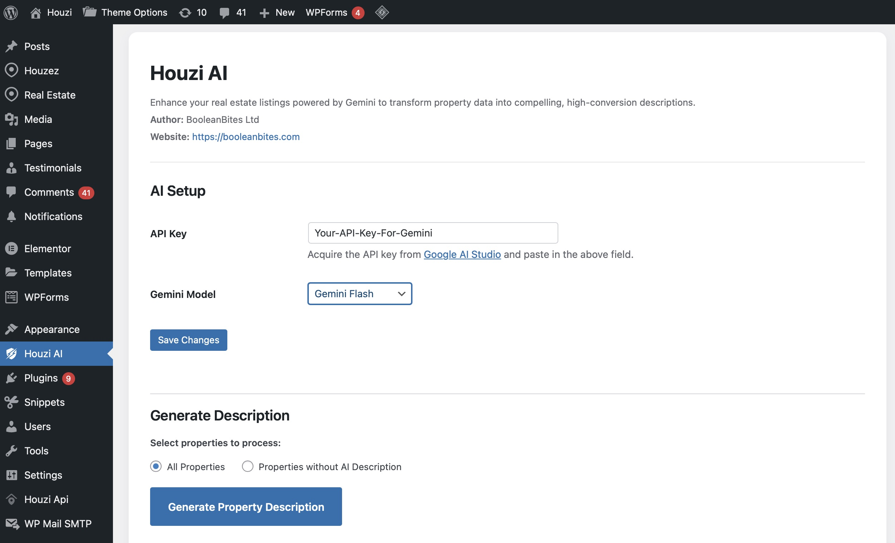

# Houzi Description AI

Enhance your real estate listings with state-of-the-art AI. **Houzi Description AI** is a professional-grade WordPress plugin designed to seamlessly integrate with the **Houzez Real Estate Theme** and the **Houzi Mobile App** ecosystem. It leverages Google's **Gemini AI** to transform raw property data into compelling, high-conversion descriptions.

## Overview

In the competitive real estate market, the quality of your property descriptions can make or break a lead. This plugin automates the copywriting process by analyzing structured data from your Houzez-powered website and generating sophisticated, human-like narratives tailored for both web and mobile users.

## Key Features

- **Gemini AI Integration**: Powered by Google’s latest Generative AI (including Gemini Flash and Flash Lite) for high-speed, high-quality content generation.
- **Deep Houzez Integration**: Automatically extracts property metadata including titles, types, status, features, location, and specifications (bedrooms, bathrooms, price, etc.) directly from the Houzez framework.
- **Bulk Content Generation**: Process your entire property portfolio efficiently with a dedicated management interface and real-time progress tracking.
- **Optimized for Houzi App**: Ensures generated descriptions are structured perfectly for display within the Houzi Real Estate mobile applications.
- **Zero-Prompt Engineering**: Pre-configured professional prompts ensure consistent, high-quality output without requiring AI expertise from the user.

## Setup & Configuration

1. **Installation**: Upload and activate the plugin within your WordPress environment.
2. **API Key**: Obtain a Gemini API Key from [Google AI Studio](https://aistudio.google.com/app/apikey) and enter it in the Houzi AI settings panel.
3. **Model Selection**: Select the Gemini model that best fits your performance and detail requirements.
4. **Execution**: Use the "Generate Property Description" dashboard to initiate the automated copywriting process for your listings.

## Workflow Integration

This plugin is designed to be part of a professional real estate workflow:
- **Analyze**: It reads the semantic data stored in your Houzez property fields.
- **Transform**: It converts technical specifications into persuasive marketing copy.
- **Update**: It automatically updates the property description, making it instantly available on your website and the Houzi mobile app.

---

### About the Ecosystem

- **Houzez Theme**: The world’s most popular WordPress theme for real estate agents and companies.
- **Houzi App**: The premier mobile solution for Houzez, providing a native app experience for iOS and Android.
- **BooleanBites**: Dedicated to building powerful tools for the modern real estate professional.

---
© 2026 BooleanBites Ltd. All rights reserved.